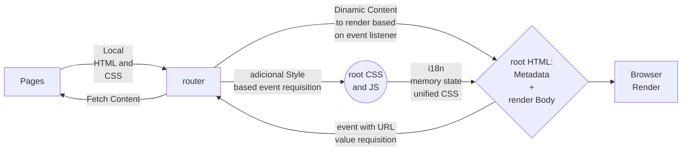

```mermaid
graph LR

A[Pages] -- Local<br> HTML and<br> CSS ---> B[router]
B -- Fetch Content --> A
B -- Dinamic Content<br> to render based<br> on event listener ---> C{root HTML:<br> Metadata<br> +<br> render Body}
C -- event with URL<br> value requisition --> B
D((root CSS<br> and JS)) -- i18n<br> memory state<br> unified CSS --> C
B -- adicional Style<br> based event requisition --> D
C --> E[Browser<br> Render]

```
