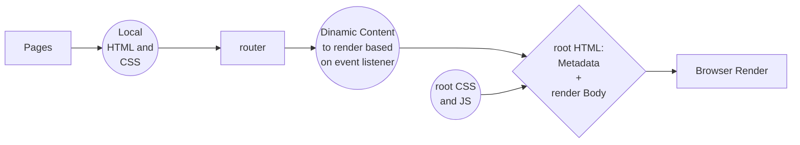

```mermaid
graph LR

A[Pages] --> A+((Local<br> HTML and<br> CSS)) ---> B[router]
B --> B+((Dinamic Content<br> to render based<br> on event listener)) ---> C{root HTML:<br> Metadata<br> +<br> render Body}
D((root CSS<br> and JS)) --> C
C --> E[Browser Render]

```