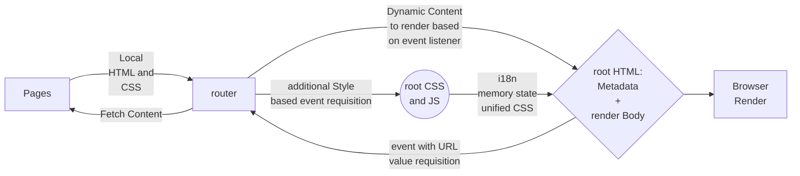

# Welcome to my portfolio :heart_eyes:

Initial state of build (Starts at 07/13. man at work :warning:)

## This app consists in a bilingual single page application made with vanilla Javascript (ooh yeah, handmade old fashion code :satisfied:)

### My premises for choose the conditions to development this webpage are:

-[] Enhancer/Show JavaScript and DOM manipulate skills through  hard work with pure JavaScript;
-[] Enhancer/Show Semantic HTML;
-[] Enhancer/Show good CSS skills with responsiveness, animations and UX/UI, through hard work no lib CSS.
-[] Enhancer/Show best practices for software development Clean Code.

### This is the diagram of components relationship.

### Access my app on Heroku: